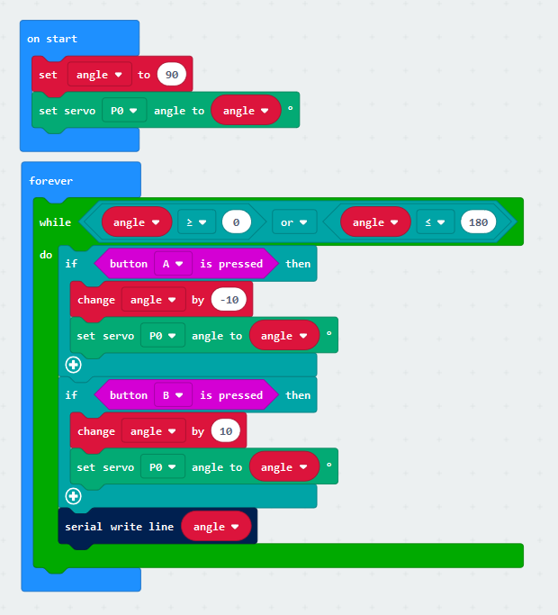

# rcmicrobit

This is an RC controller for a servo on a microbit. 

  
 
Starting from the top, the 'on start' block tells the servo to auto-set to 90 degrees on start or reset.
 
The forever loop contains the code for rotating the servo by using the A or B button, and can be broken 
down like this, starting from the top:
 
"While the angle [of the servo] is greater than or equal to 0, or the angle is less than or equal to 180,
and the A button is pressed, change the angle variable by -10 and set the servo to that angle.

Similarly, this applies to the B button, where the angle variable is changed by 10 and the servo is set to
that angle.

The servo can be stopped if the A or B button is let go during a movement of the servo.

